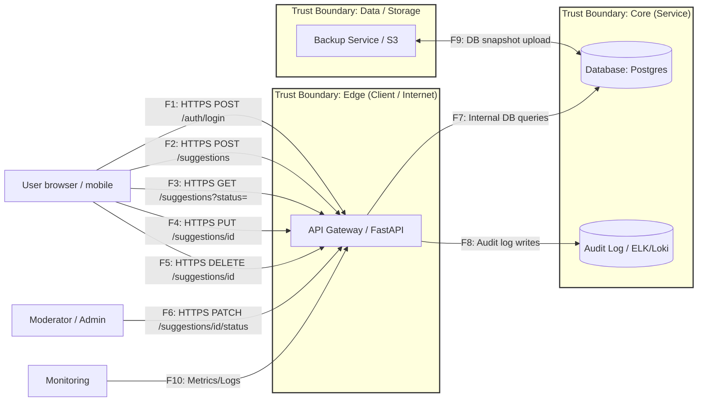

# Data Flow Diagram (DFD)

```mermaid
flowchart LR
  %% External actors
  A[User browser / mobile] -->|F1: HTTPS POST /auth/login| GW[API Gateway / FastAPI]
  A -->|F2: HTTPS POST /suggestions | GW
  A -->|F3: HTTPS GET /suggestions?status=| GW
  A -->|F4: HTTPS PUT /suggestions/id| GW
  A -->|F5: HTTPS DELETE /suggestions/id| GW
  M[Moderator / Admin] -->|F6: HTTPS PATCH /suggestions/id/status| GW
  BackupSvc[Backup Service / S3] <-->|F9: DB snapshot upload | DB[(Database: Postgres)]
  Monitoring -->|F10: Metrics/Logs | GW

  subgraph Edge["Trust Boundary: Edge (Client / Internet)"]
    GW
  end

  subgraph Core["Trust Boundary: Core (Service)"]
    GW -->|F7: Internal DB queries | DB
    GW -->|F8: Audit log writes | Audit[(Audit Log / ELK/Loki)]
  end

  subgraph Data["Trust Boundary: Data / Storage"]
    DB
    Audit
    BackupSvc
  end

  style Edge stroke:#333,stroke-width:2px
  style Core stroke:#333,stroke-width:2px
  style Data stroke:#333,stroke-width:2px
```
